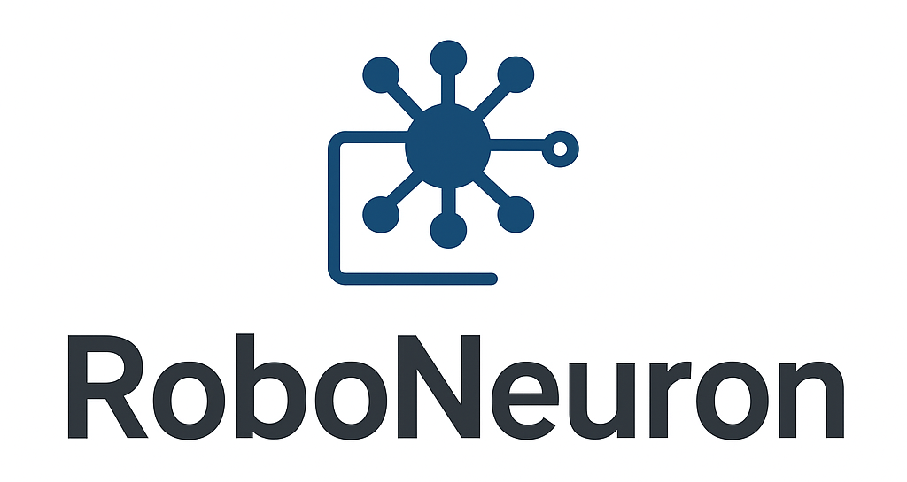
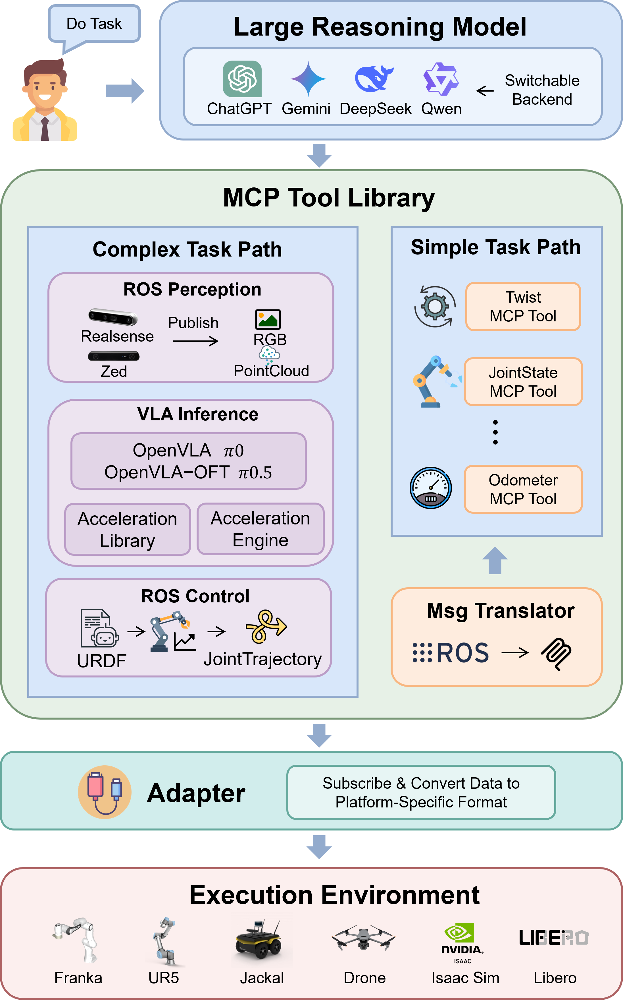

# RoboNeuron: A Modular Framework Linking Foundation Models and ROS for Embodied AI

[](https://arxiv.org/abs/2512.10394)
[](https://www.python.org/downloads/)
[](https://docs.ros.org/en/humble/)

<p align="center">
  
</p>

## Table of Contents
- [Project Overview](#project-overview)
- [Directory Structure](#directory-structure)
- [Installation & Configuration](#installation--configuration)
- [Demo Showcase](#demo-showcase)
- [Extending RoboNeuron](#extending-roboneuron)
- [Citation](#citation)

## Project Overview

**RoboNeuron** is an innovative embodied intelligence platform designed to bridge the gap between high-level AI reasoning and low-level robotic control. By integrating the **Model Context Protocol (MCP)** with **Robot Operating System (ROS 2)**, RoboNeuron modularizes the complete robotic operation pipeline—perception, reasoning, translation, and control.

This platform provides a unified interface for Large Language Models (LLMs) to orchestrate Vision-Language-Action (VLA) models, enabling complex task execution on both physical and simulated robotic systems.

<p align="center">
  
</p>


### Key Features
- **Integrated LLM-ROS Control**: Bridges LLM/VLA cognitive models with the ROS execution environment using MCP and automated ROS message translation for seamless, type-safe task orchestration.  
- **Modular Decoupling**: Strictly separated Perception, Planning, and Control modules enable flexible hardware, sensor, and algorithm replacement across deployment scenarios.  
- **VLA Integration and Acceleration**: Unified interfaces for VLA models with optimized inference pipelines allow high-performance execution and benchmarking across algorithms and hardware.


### Core Components

1. **Perception Module** (`perception_mcp.py`)
   - Manages visual data acquisition from various sources.
   - Publishes synchronized RGB/Depth streams to ROS topics.
   - Supports modular camera wrappers (Intel RealSense, Simulation Dummy, etc.).

2. **VLA Inference Module** (`infer_mcp.py`)
   - Hosts Vision-Language-Action models for real-time inference.
   - Decodes visual context and natural language instructions into robot actions.
   - Supports multiple backends including OpenVLA and OpenVLA-OFT.

3. **Control Module** (`control_mcp.py`)
   - Handles Inverse Kinematics (IK) and trajectory generation.
   - Converts Cartesian end-effector commands into joint-space trajectories.
   - Compatible with standard URDF descriptions (Panda, FR3).

4. **Model Translation & Optimization** (`translator/`)
   - Tools for converting general VLA checkpoints into optimized formats for deployment.
   - Facilitates message translation between ROS standard types and AI model tensor inputs.

## Directory Structure

```text
roboneuron/
├── README.md                     # Project documentation
│
├── config/                       # Configuration files
│   ├── vla_models.json           # VLA model paths and configurations
│   └── vla_accel_presets.json    # Inference acceleration presets
│
├── mcptoollib/                   # MCP server implementations
│   ├── control_mcp.py            # Control MCP server (Kinematics & Motion)
│   ├── eecommand_mcptool.py      # End-effector command tools
│   ├── infer_mcp.py              # VLA inference MCP server
│   ├── perception_mcp.py         # Perception MCP server
│   ├── simulation_mcp.py         # Simulation Environment MCP server
│   └── twist_mcptool.py          # Velocity (Twist) command tools
│
├── wrapper/                      # Interchangeable component wrappers
│   ├── camera_wrapper/           # Camera interface implementations
│   │   ├── base.py               # Abstract base class for cameras
│   │   └── realsense.py          # Intel RealSense implementation
│   │
│   ├── vla_wrapper/              # VLA model implementations
│   │   ├── base.py               # Abstract base class for models
│   │   ├── openvla.py            # OpenVLA standard wrapper
│   │   ├── openvla_oft.py        # OpenVLA-OFT wrapper
│   │   └── openvla_fastv.py      # OpenVLA with FastV acceleration
│   │
│   └── robot_wrapper/            # Robot hardware adapters
│       ├── base.py               # Abstract base class for robots
│       └── libero_adapter.py     # LIBERO simulation adapter
│
├── urdf/                         # Robot description files
│   ├── panda.urdf                # Franka Panda robot URDF
│   └── fr3.urdf                  # Franka Research 3 robot URDF
│
├── vla_src/                      # VLA model source code (Submodules)
│
├── translator/                   # Model conversion & message translation tools
├── template/                     # Templates for generating new MCP tools
└── ros2_msg/                     # Custom ROS 2 message definitions
```

## Installation & Configuration

### Prerequisites

- **Python 3.10+**
- **ROS 2 Humble** (recommended)
- **UV** Python package manager
- **CLine** (VS Code Extension): Required for acting as the MCP Client to orchestrate the AI models and tools.

### Step 1: Install UV Package Manager

```bash
curl -LsSf https://astral.sh/uv/install.sh | sh
```

### Step 2: Set Up ROS 2 Environment

```bash
# Install ROS 2 Humble (Ubuntu 22.04)
# Follow official instructions: https://docs.ros.org/en/humble/Installation.html

# Source ROS 2 environment
source /opt/ros/humble/setup.bash
```

### Step 3: Clone and Install RoboNeuron

```bash
# Clone the repository
git clone https://github.com/guanweifan/RoboNeuron.git
cd roboneuron

# Install dependencies
uv sync
```

### Step 4: Configure MCP Servers for Cline

To enable the Cline extension to communicate with RoboNeuron, add the following configuration to your MCP settings file.
Note: Please replace /home/user/roboneuron with the absolute path to your cloned repository.

```json
{
  "roboneuron-perception": {
    "autoApprove": [],
    "disabled": false,
    "timeout": 60,
    "type": "stdio",
    "command": "bash",
    "args": [
      "-c",
      "source /opt/ros/humble/setup.bash && uv --directory /home/user/roboneuron run -m mcptoollib.perception_mcp"
    ],
    "cwd": "/home/user/roboneuron"
  },
  "roboneuron-vla": {
    "autoApprove": [],
    "disabled": false,
    "timeout": 60,
    "type": "stdio",
    "command": "bash",
    "args": [
      "-c",
      "source /opt/ros/humble/setup.bash && uv --directory /home/user/roboneuron run -m mcptoollib.infer_mcp"
    ],
    "cwd": "/home/user/roboneuron"
  },
  "roboneuron-control": {
    "autoApprove": [],
    "disabled": false,
    "timeout": 60,
    "type": "stdio",
    "command": "bash",
    "args": [
      "-c",
      "source /opt/ros/humble/setup.bash && uv --directory /home/user/roboneuron run -m mcptoollib.control_mcp"
    ],
    "cwd": "/home/user/roboneuron"
  },
  "roboneuron-twist": {
    "autoApprove": [],
    "disabled": false,
    "timeout": 60,
    "type": "stdio",
    "command": "bash",
    "args": [
      "-c",
      "source /opt/ros/humble/setup.bash && uv --directory /home/user/roboneuron run -m mcptoollib.twist_mcptool"
    ],
    "cwd": "/home/user/roboneuron"
  },
  "roboneuron-eecommand": {
    "autoApprove": [],
    "disabled": false,
    "timeout": 60,
    "type": "stdio",
    "command": "bash",
    "args": [
      "-c",
      "source /opt/ros/humble/setup.bash && source /home/user/roboneuron/ros2_msg/install/setup.bash && uv --directory /home/user/roboneuron run -m mcptoollib.eecommand_mcptool"
    ],
    "cwd": "/home/user/roboneuron"
  }
}
```

### Step 5: Configure VLA Models

Edit `config/vla_models.json` to specify paths to your VLA model checkpoints:

```json
{
  "openvla": "/path/to/your/openvla/model",
  "openvla-oft": "/path/to/your/openvla-oft/model"
}
```

## Demo Showcase

### Case I: Unified Control of Heterogeneous Vehicles

`Instruction: "Make the car move forward at a speed of 0.5m/s"`

<div align="center">
    
</div>


---

### Case II: Kinematic-Aware Manipulation in Simulation

`Instruction: "Move the robotic arm gripper forward at a speed of 0.1m/s"`

<div align="center">
    
</div>

---

### Case III: Real-World VLA-Driven Object Grasping

`Instruction: "Using RealSense camera and OpenVLA model, to pick up the blue bowl."`

<div align="center">
    
</div>

---

## Extending RoboNeuron

### Adding New Camera Wrappers

1. Create a new file in `wrapper/camera_wrapper/`
2. Inherit from `CameraWrapper` base class
3. Implement required methods:
   ```python
   class NewCameraWrapper(CameraWrapper):
       def open(self):
           # Initialize camera connection
           pass
       
       def read(self):
           # Capture and return image
           pass
       
       def close(self):
           # Clean up resources
           pass
   ```
4. Register in `wrapper/camera_wrapper/__init__.py`

### Integrating New VLA Models

1. Create wrapper in `wrapper/vla_wrapper/`
2. Inherit from `ModelWrapper` base class
3. Implement model loading and inference:
   ```python
   class NewVLAWrapper(ModelWrapper):
       def load(self, model_path, **kwargs):
           # Load model weights and configuration
           pass
       
       def predict_action(self, image, instruction):
           # Generate action from image and instruction
           pass
   ```
4. Add model configuration to `config/vla_models.json`

### Supporting New Robot Platforms

1. Create adapter in `wrapper/robot_wrapper/`
2. Implement platform-specific communication
3. Provide URDF or kinematic description
4. Test with simulation before hardware deployment

### Registering a Custom ROS 2 Message

If you create a new ROS message file under your project directory, for example: `ros2_msg/custom_msgs/msg/test.msg`, you must rebuild and source the ROS 2 workspace so the new message type becomes available to ROS and your MCP tools.

```bash
# Navigate to your workspace
cd ros2_msg

# Install dependencies
rosdep install --from-paths src -i -y

# Build the workspace
colcon build --symlink-install

# Source the workspace
source install/setup.bash
```


### Creating Custom MCP Tools

Use the template system to generate new MCP tools:

```bash
# Generate new MCP tool template
uv run generator.py your_topic your_msg
```


## Citation

If you use this project, please cite the paper:
```
@misc{guan2025roboneuronmodularframeworklinking,
      title={RoboNeuron: A Modular Framework Linking Foundation Models and ROS for Embodied AI}, 
      author={Weifan Guan and Huasen Xi and Chenxiao Zhang and Aosheng Li and Qinghao Hu and Jian Cheng},
      year={2025},
      eprint={2512.10394},
      archivePrefix={arXiv},
      primaryClass={cs.RO},
      url={https://arxiv.org/abs/2512.10394}, 
}
```

---
