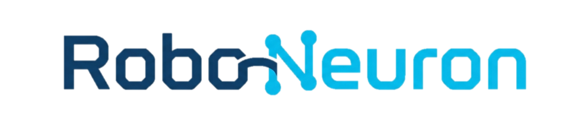
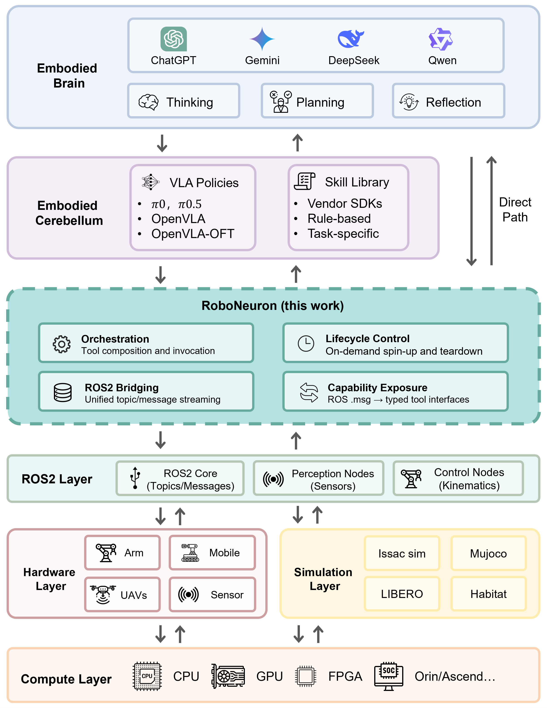
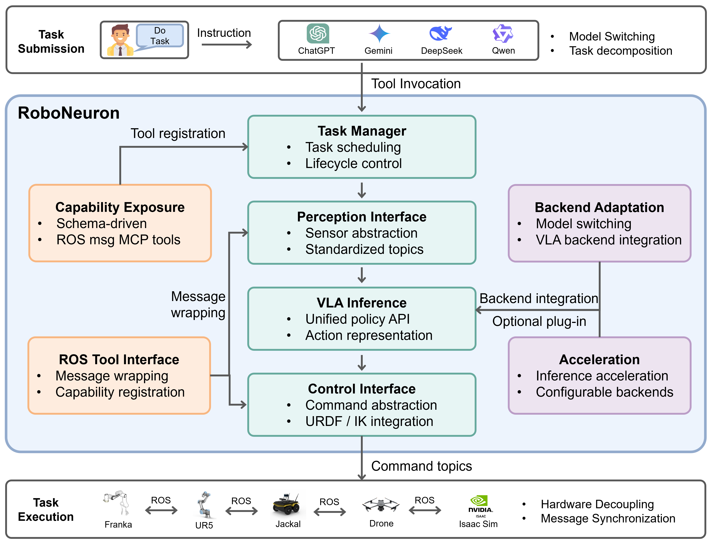

# RoboNeuron: A Modular Framework Linking Foundation Models and ROS for Embodied AI

[](https://arxiv.org/abs/2512.10394)
[](https://www.python.org/downloads/)
[](https://docs.ros.org/en/jazzy/)

<p align="center">
  
</p>

## Table of Contents
- [Project Overview](#project-overview)
- [Directory Structure](#directory-structure)
- [Structure Notes](#structure-notes)
- [Installation & Configuration](#installation--configuration)
- [Demo Showcase](#demo-showcase)
- [Extending RoboNeuron](#extending-roboneuron)
- [Citation](#citation)

## Project Overview

**RoboNeuron** is a **ROS2-native middleware layer for embodied AI**. It connects perception, VLA inference, control resolution, and MCP-based capability exposure without binding model logic directly to robot-specific runtime code.

<p align="center">
  
</p>

<p align="center"><em>RoboNeuron as the middleware layer between embodied intelligence and ROS 2 execution.</em></p>

At its core, RoboNeuron separates **agent-facing orchestration** from **ROS 2 execution**, enabling two main patterns:

- **Direct tool-to-ROS execution** for low-latency robot commands
- **Closed-loop perception → VLA inference → control pipelines** for embodied tasks

<p align="center">
  
</p>

<p align="center"><em>Unified architecture for capability exposure, orchestration, and ROS-backed execution.</em></p>

### Highlights

- **Small set of core runtime modules**: `perception`, `vla`, and `control` remain the main execution spine
- **ROS-native execution**: integrates with existing ROS 2 topics, messages, and controllers
- **VLA-ready infrastructure**: supports `dummy`, `openvla`, and `openvla-oft` through a shared adapter interface
- **Tool-based capability exposure**: maps robot functions into structured callable interfaces for agent workflows
- **Deployment-friendly**: keeps heavy VLA dependencies isolated in dedicated runtimes and MCP launchers

In short, RoboNeuron is a **reusable infrastructure layer** for building, testing, and deploying embodied AI pipelines on top of ROS 2.

## Directory Structure

```text
roboneuron/
├── README.md                     # Project documentation
├── docs/                         # Architecture notes and longer-form project analysis
├── pyproject.toml
├── uv.lock
├── src/
│   ├── roboneuron_core/          # Core runtime, kernel, adapters, and shared boundaries
│   │   ├── servers/              # Core runtime hosts: perception / vla
│   │   │   └── generated/        # Generated MCP server modules for raw ROS message exposure
│   │   ├── adapters/             # Camera and VLA wrappers only
│   │   ├── runtime/              # Dedicated worker/client runtimes for heavy VLA stacks
│   │   ├── kernel/               # Shared runtime primitives and action semantics
│   │   ├── cli/                  # MCP entrypoints and tool generation CLI
│   │   └── utils/                # Shared boundary helpers used by core and edge
│   ├── roboneuron_edge/          # Edge control host, state alignment, and local resolving
│   └── roboneuron_backends/      # Robot backend integrations and vendor-facing glue
├── configs/                      # Configuration files
│   ├── vla_models.json           # VLA model paths and runtime configuration
│   └── openclaw/                 # OpenClaw-facing MCP launcher configuration
├── openclaw/                     # First-class OpenClaw integration assets and skills
├── tests/                        # Flat test suite (unit/integration via pytest markers)
├── assets/                       # README assets
├── templates/                    # Templates for generating new MCP tools
├── urdf/                         # Robot description files
│   ├── panda.urdf                # Franka Panda robot URDF
│   └── fr3.urdf                  # Franka Research 3 robot URDF
├── ros/
│   └── roboneuron_interfaces/    # First-party ROS interface package
└── third_party/
    └── vla_src/                  # Vendored VLA source trees
```

## Structure Notes

RoboNeuron should be understood through four layers:

- **Core**: [perception_server.py](./src/roboneuron_core/servers/perception_server.py), [vla_server.py](./src/roboneuron_core/servers/vla_server.py), `kernel/`, and the model/runtime stack live in `roboneuron_core`.
- **Edge**: [control_server.py](./src/roboneuron_edge/servers/control_server.py), `runtime/`, and `state/` in `roboneuron_edge` own local resolving and state alignment.
- **Backends**: `roboneuron_backends/` owns vendor-facing robot backend glue such as Franka metadata and integrations.
- **ROS boundary**: `ros/roboneuron_interfaces` defines first-party message contracts used to connect RoboNeuron to ROS 2 systems.
- **Integrations and configs**: `configs/` holds stable configuration, and `openclaw/` contains the first-class OpenClaw integration surface.

For a more opinionated analysis of the current structure and future direction, see [docs/roboneuron-structure-and-roadmap.md](./docs/roboneuron-structure-and-roadmap.md).

## Installation & Configuration

### Prerequisites

- **Python 3.12+**
- **ROS 2 Jazzy** (recommended)
- **UV** Python package manager
- **CLine** (VS Code Extension): Required for acting as the MCP Client to orchestrate the AI models and tools.

ROS 2 Humble is still supported, but this README now defaults to Jazzy paths and examples. If you use Humble, you need to replace the distro-specific commands and paths yourself, and align the local Python / ROS package setup for that distro.

### Step 1: Install UV Package Manager

```bash
curl -LsSf https://astral.sh/uv/install.sh | sh
```

### Step 2: Set Up ROS 2 Environment

```bash
# Install ROS 2 Jazzy (Ubuntu 24.04)
# Follow official instructions: https://docs.ros.org/en/jazzy/Installation.html

# Source ROS 2 environment
source /opt/ros/jazzy/setup.bash
```

If you use ROS 2 Humble instead, replace the Jazzy path above with `/opt/ros/humble/setup.bash` and adjust any distro-specific package installation steps accordingly.

### Step 3: Clone and Install RoboNeuron

```bash
# Clone the repository together with tracked VLA source submodules
git clone --recurse-submodules https://github.com/guanweifan/RoboNeuron.git
cd roboneuron

# Install dependencies for the main RoboNeuron environment (Python 3.12)
# This default environment stays minimal and does not install PyTorch.
uv sync

# Only install the VLA extra on machines that actually run RoboNeuron VLA services.
uv sync --extra vla
```

### Step 4: Build the ROS Interface Workspace

The unified `EEFDeltaCommand` message is defined in `ros/roboneuron_interfaces`. Build it locally before starting MCP services that publish or consume task-space actions.

```bash
cd ros
rosdep install --from-paths roboneuron_interfaces -i -y
colcon build --packages-select roboneuron_interfaces --symlink-install --cmake-args -DPython3_EXECUTABLE=/usr/bin/python3
source install/setup.bash
cd ..
```

### Step 5: Configure MCP Servers for Cline

To enable the Cline extension to communicate with RoboNeuron, add the following configuration to your MCP settings file.
Note: Please replace /home/user/roboneuron with the absolute path to your cloned repository.

```json
{
  "mcpServers": {
    "roboneuron-perception": {
    "autoApprove": [],
    "disabled": false,
    "timeout": 60,
    "type": "stdio",
    "command": "bash",
    "args": [
      "-c",
      "source /opt/ros/jazzy/setup.bash && uv --directory /home/user/roboneuron run roboneuron-mcp-perception"
    ],
    "cwd": "/home/user/roboneuron"
    },
    "roboneuron-vla": {
    "autoApprove": [],
    "disabled": false,
    "timeout": 60,
    "type": "stdio",
    "command": "bash",
    "args": [
      "-c",
      "source /opt/ros/jazzy/setup.bash && source /home/user/roboneuron/ros/install/setup.bash && uv --directory /home/user/roboneuron run --extra vla roboneuron-mcp-vla"
    ],
    "cwd": "/home/user/roboneuron"
    },
    "roboneuron-control": {
    "autoApprove": [],
    "disabled": false,
    "timeout": 60,
    "type": "stdio",
    "command": "bash",
    "args": [
      "-c",
      "source /opt/ros/jazzy/setup.bash && source /home/user/roboneuron/ros/install/setup.bash && uv --directory /home/user/roboneuron run roboneuron-mcp-control"
    ],
    "cwd": "/home/user/roboneuron"
    },
    "roboneuron-twist": {
    "autoApprove": [],
    "disabled": false,
    "timeout": 60,
    "type": "stdio",
    "command": "bash",
    "args": [
      "-c",
      "source /opt/ros/jazzy/setup.bash && uv --directory /home/user/roboneuron run roboneuron-mcp-twist"
    ],
    "cwd": "/home/user/roboneuron"
    },
    "roboneuron-eef-delta": {
    "autoApprove": [],
    "disabled": false,
    "timeout": 60,
    "type": "stdio",
    "command": "bash",
    "args": [
      "-c",
      "source /opt/ros/jazzy/setup.bash && source /home/user/roboneuron/ros/install/setup.bash && uv --directory /home/user/roboneuron run roboneuron-mcp-eef-delta"
    ],
    "cwd": "/home/user/roboneuron"
    }
  }
}
```

For OpenClaw workflows, the repo-scoped `mcporter` configuration now lives at `configs/openclaw/mcporter.json`.

### Step 6: Set Up the Dedicated OpenVLA Runtime

OpenVLA now runs in its own Python environment instead of the main RoboNeuron environment. This keeps the primary `uv sync` environment minimal and isolates model-specific dependencies such as `transformers`, `flash-attn`, and vendored `prismatic`.

The main RoboNeuron environment now targets Python 3.12 / ROS 2 Jazzy, while the dedicated `openvla` and `openvla-oft` runtimes stay on Python 3.10 to match the upstream OpenVLA dependency stack.

Create the runtime with:

```bash
bash scripts/setup_openvla_runtime.sh
```

For `openvla-oft`, create the separate runtime with:

```bash
bash scripts/setup_openvla_oft_runtime.sh
```

By default this creates `.venvs/openvla` and installs:

- `torch==2.2.0`, `torchvision==0.17.0`, `torchaudio==2.2.0` from the CUDA 11.8 PyTorch index
- the minimal OpenVLA inference dependencies
- the local `flash_attn` wheel if `flash_attn-*.whl` exists at the repository root

The `openvla-oft` runtime keeps the same PyTorch / FlashAttention versions as `openvla`, but adds the extra
dependencies needed by the OFT action heads and proprio projector.

### Step 7: Configure VLA Models

Edit `configs/vla_models.json` to specify model checkpoints and runtime configuration:

```json
{
  "openvla": {
    "path": "checkpoints/openvla/openvla-7b",
    "runtime_python": ".venvs/openvla/bin/python",
    "attn_implementation": "flash_attention_2",
    "default_unnorm_key": "bridge_orig",
    "runtime_startup_timeout_sec": 900
  },
  "openvla-oft": {
    "path": "checkpoints/openvla-oft/openvla-oft-pick-banana",
    "runtime_python": ".venvs/openvla-oft/bin/python",
    "attn_implementation": "flash_attention_2",
    "default_unnorm_key": "vr_banana",
    "runtime_startup_timeout_sec": 1800,
    "robot_platform": "bridge",
    "use_film": true,
    "use_proprio": true,
    "num_images_in_input": 1,
    "default_proprio": [0, 0, 0, 0, 0, 0, 0]
  }
}
```

When `model_path` is omitted from `start_vla_inference`, RoboNeuron resolves both the checkpoint path and the runtime-specific kwargs from this config file.

`openvla-oft` also ships with an integration smoke test that targets `checkpoints/openvla-oft/openvla-oft-pick-banana`.
After the dedicated runtime is ready, run:

```bash
pytest -q tests/test_openvla_oft_deploy_smoke.py -m integration
```

### Included Lightweight Validation Components

- `src/roboneuron_core/adapters/vla/dummy_vla.py`: lightweight pipeline test model.

### CLI Entrypoints

Canonical service entrypoints are:

- `uv run roboneuron-mcp-perception`
- `source ros/install/setup.bash && uv run --extra vla roboneuron-mcp-vla`
- `source ros/install/setup.bash && uv run roboneuron-mcp-control`
- `uv run roboneuron-mcp-twist`
- `source ros/install/setup.bash && uv run roboneuron-mcp-eef-delta`

## Demo Showcase

### Case I: Unified Control of Heterogeneous Vehicles

`Instruction: "Make the car move forward at a speed of 0.5m/s"`

<div align="center">
    
</div>


---

### Case II: Kinematic-Aware Manipulation in Simulation

`Instruction: "Move the robotic arm gripper forward at a speed of 0.1m/s"`

<div align="center">
    
</div>

---

### Case III: Real-World VLA-Driven Object Grasping

`Instruction: "Using an RGB camera and OpenVLA model, pick up the blue bowl."`

<div align="center">
    
</div>

---

## Extending RoboNeuron

### Adding New Camera Wrappers

1. Create a new file in `src/roboneuron_core/adapters/camera/`
2. Inherit from `CameraWrapper` base class
3. Implement required methods:
   ```python
   class NewCameraWrapper(CameraWrapper):
       def open(self):
           # Initialize camera connection
           pass
       
       def read(self):
           # Capture and return image
           pass
       
       def close(self):
           # Clean up resources
           pass
   ```
4. Register in `src/roboneuron_core/adapters/camera/__init__.py`

### Integrating New VLA Models

1. Create wrapper in `src/roboneuron_core/adapters/vla/`
2. Inherit from `ModelWrapper` base class
3. Implement model loading and inference:
   ```python
   class NewVLAWrapper(ModelWrapper):
       def load(self, model_path, **kwargs):
           # Load model weights and configuration
           pass
       
       def predict_action(self, image, instruction):
           # Generate action from image and instruction
           pass
   ```
4. Add model configuration to `configs/vla_models.json`

### Connecting New Robot Platforms

1. Provide a URDF or equivalent kinematic description under `urdf/`
2. Identify the robot's ROS 2 state and command topics
3. Start the control runtime with the matching URDF and topic bindings
4. Validate the control path with focused tests before hardware deployment

Use `uv run roboneuron-validate-local` as the stable local validation entrypoint before moving on to ROS or hardware-specific checks.

### Registering a Custom ROS 2 Message

If you create a new ROS message file under your project directory, for example: `ros/roboneuron_interfaces/msg/Test.msg`, you must rebuild and source the ROS 2 workspace so the new message type becomes available to ROS and your MCP tools.

```bash
# Navigate to your workspace
cd ros

# Install dependencies
rosdep install --from-paths roboneuron_interfaces -i -y

# Build the workspace
colcon build --symlink-install

# Source the workspace
source install/setup.bash
```


### Creating Custom MCP Tools

Use the template system to generate new MCP tools:

```bash
# Generate new MCP tool template
uv run python -m roboneuron_core.cli.mcp_tool_generator your_topic your_msg
```


## Citation

If you use this project, please cite the paper:
```
@misc{guan2025roboneuronmodularframeworklinking,
      title={RoboNeuron: A Modular Framework Linking Foundation Models and ROS for Embodied AI}, 
      author={Weifan Guan and Huasen Xi and Chenxiao Zhang and Aosheng Li and Qinghao Hu and Jian Cheng},
      year={2025},
      eprint={2512.10394},
      archivePrefix={arXiv},
      primaryClass={cs.RO},
      url={https://arxiv.org/abs/2512.10394}, 
}
```

## License

This project is licensed under the MIT License. See the [LICENSE](./LICENSE) file for details.

---
